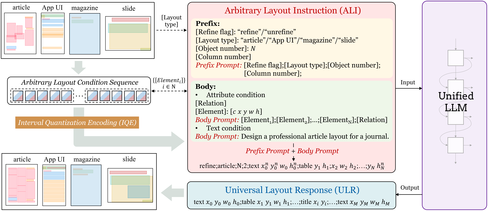

# <div align="center">:stars:LGGPT

<div align="center">
  <a href="http://dlvc-lab.net/lianwen/"> </a>
  <a href="https://link.springer.com/article/10.1007/s11263-025-02353-2"> </a>
  <a href="https://arxiv.org/abs/2502.14005"> </a>
  <a href="https://huggingface.co/papers/2502.14005"> </a>
  <a href="./LICENSE"> </a>
<p></p>


<a href="https://arxiv.org/abs/2502.14005"> <b>Smaller But Better: Unifying Layout Generation with Smaller Large Language Models</b> </a>

<b>International Journal of Computer Vision (IJCV), 2025</b>

:star:Official code of the LGGPT model.
</div>

## <div align="center">:ocean:Introduction</div>

LGGPT is an LLM-based model that unifies arbitrary tasks and multiple domains of layout generation. It is developed based on GPT2-XL (1.5B parameters), which proves that LLM of such a small scale can achieve competitive layout generation performance across various tasks and multiple layout domains.



<div align="center"><i>The framework of LGGPT</i></div>

## <div align="center">:earth_asia:Environment</div>

```bash
git clone https://github.com/NiceRingNode/LGGPT.git
cd LGGPT
conda create -n lggpt python=3.8.16
conda activate lggpt
pip install -r requirements.txt
```

## <div align="center">:hammer_and_pick:Data Preparation</div>

Download five layout datasets: [PubLayNet](https://developer.ibm.com/exchanges/data/all/publaynet/), [Rico](http://www.interactionmining.org/rico.html), [Magazine](https://xtqiao.com/projects/content_aware_layout/), [WiSe](https://cvhci.anthropomatik.kit.edu/~mhaurile/spase/), [SPaSe](https://cvhci.anthropomatik.kit.edu/~mhaurile/wise/). Create a new folder termed `data-raw`, unzipping these datasets in the `data-raw` with the following format:

```bash
data-raw
├── publaynet-image
│   ├── train.json
│   ├── val.json
│   └── ...
├── rico_dataset_v0.1_semantic_annotations
│   └── semantic_annotations
├── MagLayout/layoutdata
│   ├── annotations
│   └── ...
├── WiSe
│   ├── labels
│   └── ...
├── SPaSe
│   ├── labels
│   └── ...
```

Run the `process.sh` to preprocess the dataset.

```bash
bash preprocess.sh
```

The training data are stored in the `data/unified` folder, and the testing data for PubLayNet, Rico, and Magazine are stored in the `data/publaynet`, `data/rico`, and `data/magazine` folders. The directories are as follows.

```
data
├── unified
│   └── train.txt
├── publaynet
│   ├── val_prompt.txt
│   ├── val.txt
│   └── train.txt
├── rico
│   ├── test_prompt.txt
│   ├── test.txt
│   └── train.txt
├── magazine
│   ├── test_prompt.txt
│   ├── test.txt
│   └── train.txt
├── slide
│   ├── test.txt
│   └── train.txt
```

We also provide a well-processed training data used in the training of the paper, which can be downloaded from the these links ([Baidu Cloud](https://pan.baidu.com/s/1Imy3XsQlPMUmuHEwSe1NdA?pwd=m3tn)/[Google Drive](https://drive.google.com/drive/folders/1h7Db-CIldJqFZEt9UsoZE_g2YjL6nz7K?usp=sharing)) and directly used for training. However, the testing data must be explicitly processed and prepared. 

## <div align="center">:rocket:Train</div>

Before training, please complete the following two preparation steps:

First, download the model's pretrained weights from :hugs:[HuggingFace](https://huggingface.co/) (*e.g.*, [GPT2-XL](https://huggingface.co/openai-community/gpt2-xl)) and place it at the local folder (*e.g.*, `gpt2-xl`). Specify the path to this folder in the config file. (*e.g.*, `config/gpt2.yaml`).

Second, modify the `GPT2LMHeadModel` implementation in the `transformers` library. Locate the source code file under the path `/your/path/to/miniconda3/envs/lggpt/lib/python3.8/site-packages/transformers/models/gpt2/modeling_gpt2.py`, change
```python
shift_logits = lm_logits[..., :, :-1].contiguous()
shift_labels = labels[..., 1:].contiguous()
```
to
```python
shift_logits = lm_logits[..., :, :].contiguous()
shift_labels = labels[..., :].contiguous()
```

Then you are free to run the training code as:
```bash
CUDA_VISIBLE_DEVICES=0,1,2,3 torchrun --nproc_per_node=4 train.py \
  --dataset 'unified' \
  --notes 'training for unified data' \
  --name 'LGGPT' \
  --config 'config/gpt2.yaml'
```

One can specify the running devices using `CUDA_VISIBLE_DEVICES` and adjust the number of GPU devices with `nproc_per_node` accordingly.

## <div align="center">:clinking_glasses:Test​​</div>

```bash
python test.py \
  --weights weights/gpt2unify-20250218-121251/checkpoint-23000/pytorch_model.bin \
  --dataset publaynet \
  --cond C \
  --temp 1.0 \
  --gpu 1
```

The model is trained with unified data across various tasks and multiple domains, while it is is evaluated independently for each task and dataset. The of parameters for testing are as follows:

- `weights`: The checkpoint's path.
- `dataset`: The dataset used for testing, including: `publaynet`, `rico`, and `magazine`.
- `cond`: The task type for testing. Available task types include: `C` for Completion, `T` for Gen-T, `T-S` for Gen-TS, `T-L-R` for Relation, `R` for Refinement, `U` for Gen-U, `U-P` for Gen-UP, `C-R-A` for Completion-Refinement, `T-S-P` for Gen-TPS, `P-S-R` for Gen-PS-Refinement, `B-R` for Gen-Arb-Refinement. See the paper for detailed task definitions.
- `temp`: Temperature parameter used in inference. `temp > 0` indicates performing sampling during layout generation, while `temp = 0.` indicates that sampling is not performed.
- `gpu`: GPU used for testing.

If the testing was interrupted, one can resume it through:

```bash
python test.py \
  --weights weights/LGGPT-20250218-121251/checkpoint-23000/pytorch_model.bin \
  --dataset publaynet \
  --cond C \
  --temp 1.0 \
  --gpu 1 \
  --rmp weights/LGGPT-20250218-121251/checkpoint-23000/C-sample59-metrics.pth
```

The `rmp` parameter specifies the path to the previous evaluation results that are automatically stored.

## <div align="center">:clipboard:Citation</div>

```bibtex
@article{lggpt2025zhang,
  title={{Smaller But Better: Unifying Layout Generation with Smaller Large Language Models}},
  author={Zhang, Peirong and Zhang, Jiaxin and Cao, Jiahuan and Li, Hongliang and Jin, Lianwen},
  journal={International Journal of Computer Vision (IJCV)},
  volume={133},
  pages={3891–3917},
  year={2025}
}
```

## <div align="center">:pager:Cotact</div>

Peirong Zhang: eeprzhang@mail.scut.edu.cn

## <div align="center">:bookmark_tabs:Copyright</div>

Copyright 2025, Deep Learning and Vision Computing (DLVC) Lab, South China China University of Technology. [http://www.dlvc-lab.net](http://www.dlvc-lab.net/).

